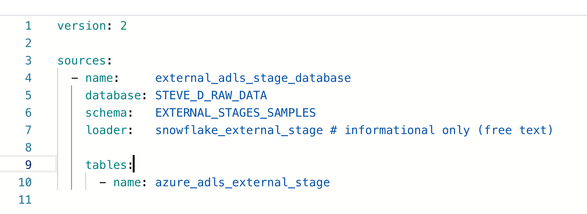

## `COPY INTO` Snowflake Materialization Documentation

### Objects that need to be set up to leverage this solution:

**On the dbt side:** 

1. Need to add the `copy_into` materialization macro into your `/macros` folder
    - This marco can be found [here on github](../../../../macros/materializations/copy_into/copy_into.sql)
2. Need to create a YAML source file or leverage an existing source file and add in your external stage information
    - An example of a source file for this can be found [here on github](../copy_into_demo_src.yml)
3. Need to create a model that selects from the external stage, this model is where a table will be created and COPY INTO will be run into that table every time the dbt model is run
    - An example of this model can be found [here on github](../copy_into_demo.sql)
    

**On the Snowflake side:**

1. Need to have an external stage created, with data in it
    1. For more information on external stages, check out this [Snowflake documentation](https://docs.snowflake.com/en/sql-reference/sql/create-stage.html) 
2. Need to have a file format created for the external stage that can be referenced when reading files out of the external stage
    1. For more information on snowflake file formats, check out this [Snowflake documentation](https://docs.snowflake.com/en/sql-reference/sql/create-file-format.html) 
    

### How does it work?

- When the model that is leveraging the `copy_into` materialization is run (e.g. `dbt run -s <<model_using_copy_into>>`):
    - If it is the first time the model is running or the `--full-refresh` statement is applied:
        - Snowflake will create the table that data is going to be copied into from the external storage
    - Once the table is created, dbt will grab the SQL in the model and wrap a `COPY_INTO` command around it and send it down to Snowflake. This will pick up any net new files in the external stage and put the data in the table.
        - This action is [idempotent](https://stackoverflow.com/questions/1077412/what-is-an-idempotent-operation), i.g. you can run it as many times as you want and ONLY new data will be picked up and put into the table unless you are running a `--full-refresh` which will recreate the table and load everything again
        

### Example:

**Resources used for this example:** 

- Snowflake Database Where External Stage is: `STEVE_D_SANDBOX`
- Snowflake Schema Where External Stage is: `EXTERNAL_STAGES_SAMPLES`
- Snowflake External Stage Name: `AZURE_ADLS_EXTERNAL_STAGE`
- Snowflake File Format That Was Created: `BASIC_CSV`

**Example Scenario:**

- Data comes into my external storage in csv format, it is information on AZ housing prices
- A new csv file lands into my storage daily with new listing from the AZ housing market and this needs to be processed into a Snowflake table using the `COPY INTO` command by running a dbt model

**Setting up my source file `copy_into_demo_src.yml` :**

- This is my reference to my external stage

- database: the name of the database where my external stage lives
- schema: the name of the schema where my external stage lives
- *loader: optional metadata field to describe how my data is being loaded*
- table name: the name of my external stage

**Setting up my model `copy_into_demo.sql`:**

- I created this model to grab info out of the external stage, parse and name the columns into the right data type

- Notice that i'm using the "@" before my source call to let Snowflake know it's a stage
- I also provide a file format that I created in Snowflake, in this file format I call it in the following way `<DATABASE>.<SCHEMA>.<FILE_FORMAT_NAME>`
    - File formats live inside a database & schema so you need these prefixes to ensure you are using the right one in dbt
    
- Right away in dbt cloud, I can see the linage of grabbing from my external stage and putting data into my new table
    
    
    
- If I click preview I’ll see the data in my external stage based on the query I wrote:
    
    
    

**Running my model (`dbt run -s copy_into_demo` ):**

- Kick my model off in dbt cloud
    
    
    
- If my model is running for the first time:
    - This will create a table in Snowflake named `COPY_INTO_DEMO` where every time the model is run, the copy into command will be run to get new data from the external stage and put it into the table
    - The `COPY INTO` command that got run in Snowflake for my example
        
        
        
        - The logging output from this run in Snowflake, I can see two files got picked up and loaded into my table:
            
            
            
        - What my final table looks like in Snowflake with the loaded data:
            
            
            

- If I run the model again after putting new files in the external stage, it will ONLY pick up those new files and put them into my table
    - If no new files are added, nothing will get added to the table
